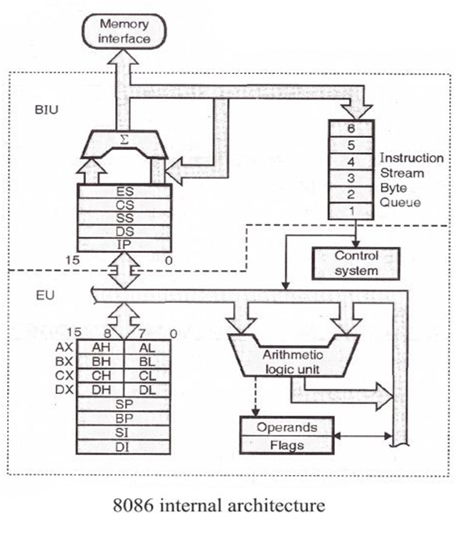
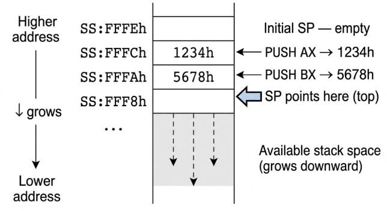
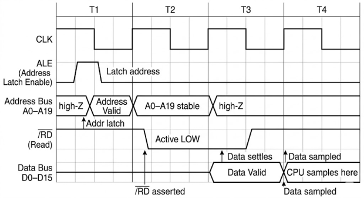

# Intel 8086 Microprocessor Architecture — Complete Reference

> A complete technical reference to the Intel 8086: internal architecture, registers,
> buses, memory segmentation, addressing modes, pipelining, interrupts and pinout.

---

## Table of Contents

- [Intel 8086 Microprocessor Architecture — Complete Reference](#intel-8086-microprocessor-architecture--complete-reference)
  - [Table of Contents](#table-of-contents)
  - [1. Overview](#1-overview)
  - [2. High-Level Architecture](#2-high-level-architecture)
    - [2.1 Bus Interface Unit (BIU)](#21-bus-interface-unit-biu)
    - [2.2 Execution Unit (EU)](#22-execution-unit-eu)
    - [2.3 Instruction Queue (Pipelining)](#23-instruction-queue-pipelining)
  - [3. Register Set](#3-register-set)
    - [3.1 General-Purpose Registers](#31-general-purpose-registers)
    - [3.2 Pointer and Index Registers (Special-Registers)](#32-pointer-and-index-registers-special-registers)
      - [Stack:](#stack)
    - [3.3 Segment Registers](#33-segment-registers)
    - [3.4 Instruction Pointer (IP)](#34-instruction-pointer-ip)
    - [3.5 FLAGS Register](#35-flags-register)
    - [3.6 Full Register Map Diagram](#36-full-register-map-diagram)
  - [4. Memory Segmentation](#4-memory-segmentation)
    - [4.1 Physical Address Calculation](#41-physical-address-calculation)
    - [4.2 Default Segment Associations](#42-default-segment-associations)
    - [4.3 Segment Overlap](#43-segment-overlap)
  - [5. Buses](#5-buses)
    - [5.1 Address Bus](#51-address-bus)
    - [5.2 Data Bus](#52-data-bus)
    - [5.3 Control Bus](#53-control-bus)
    - [5.4 Multiplexed Address/Data Bus](#54-multiplexed-addressdata-bus)
  - [6. Addressing Modes](#6-addressing-modes)
  - [7. Pin Diagram and Signal Description](#7-pin-diagram-and-signal-description)
  - [8. Minimum vs Maximum Mode](#8-minimum-vs-maximum-mode)
  - [9. Bus Timing (T-States)](#9-bus-timing-t-states)
  - [10. Interrupt System](#10-interrupt-system)
  - [11. Instruction Execution Flow (Pipeline Diagram)](#11-instruction-execution-flow-pipeline-diagram)
  - [12. Quick Reference Tables](#12-quick-reference-tables)
  - [13. Resources](#13-resources)

---

## 1. Overview

The **Intel 8086** is a 16-bit microprocessor introduced by Intel on June 8, 1978. It was
the first member of the x86 family, and its architectural choices — 16-bit registers,
segmented memory, a 20-bit physical address space — defined the programming model that
x86 processors still trace their lineage back to.

| Property | Value |
|---|---|
| Data width (internal/external) | 16 bits |
| Address bus width | 20 bits |
| Physical address space | 1 MiB (2²⁰ bytes) |
| I/O address space | 64 KiB |
| Register width | 16 bits |
| Instruction queue (prefetch buffer) | 6 bytes |
| Package | 40-pin DIP |
| Transistor count | ~29,000 |
| Clock speeds (original) | 5, 8, 10 MHz variants |

The 8086 is internally divided into two independent, concurrently operating processing
units: the **Bus Interface Unit (BIU)** and the **Execution Unit (EU)**. This split is the
key to understanding almost everything else about the chip, including why it can
prefetch instructions while still executing previous ones.

---

## 2. High-Level Architecture

<div align="center">
    
</div>

### 2.1 Bus Interface Unit (BIU)

The BIU is responsible for **all communication with the outside world** — memory and
I/O. Its jobs:

- Generate the 20-bit physical address `segment × 16 + offset` OR `segment < 4 + offset` for every memory access.
- Fetch instruction bytes from memory **ahead of time** and push them into the
  instruction queue.
- Fetch/write operand data requested by the EU.
- Hold the four **segment registers** (`CS`, `DS`, `SS`, `ES`) and the
  **Instruction Pointer** (`IP`).
- Control the address, data, and control buses.

### 2.2 Execution Unit (EU)

The EU has no connection to the system buses at all — it works purely on registers and
internally-fetched data. Its jobs:

- Decode instructions pulled from the instruction queue.
- Execute instructions using the ALU.
- Hold and update general-purpose registers (`AX`,`BX`,`CX`,`DX`), pointer/index
  registers (`SP`,`BP`,`SI`,`DI`), and the `FLAGS` register.
- Request the BIU to fetch or store operands when memory access is needed.

Because the EU and BIU operate **concurrently**, the BIU can fetch the next
instruction(s) into the queue while the EU is still busy executing the current one —
this overlap is the 8086's simple pipelining mechanism.

### 2.3 Instruction Queue (Pipelining)

The BIU maintains a **6-byte prefetch queue** (FIFO). Whenever the queue has 2+ empty
bytes and the bus isn't otherwise in use, the BIU fetches more instruction bytes from
memory at `CS:IP` and appends them to the queue.

```
Instruction Queue (FIFO, 6 bytes)
┌────┬────┬────┬────┬────┬────┐
│ Q0 │ Q1 │ Q2 │ Q3 │ Q4 │ Q5 │   ← bytes fetched ahead of execution
└────┴────┴────┴────┴────┴────┘
   ▲                        ▲
   │                        └── newest byte fetched from memory
   └── next byte to be consumed by EU decoder
```

The queue is **flushed** whenever a jump, call, or return changes the flow of control,
since the prefetched bytes downstream of the branch are no longer valid — the BIU must
then fetch fresh bytes starting at the new `CS:IP`.

---

## 3. Register Set

The 8086 exposes **14 programmer-visible 16-bit registers**:

| Category | Registers |
|---|---|
| General-purpose | `AX`, `BX`, `CX`, `DX` |
| Pointer | `SP`, `BP` |
| Index | `SI`, `DI` |
| Segment | `CS`, `DS`, `SS`, `ES` |
| Control | `IP`, `FLAGS` |

---

### 3.1 General-Purpose Registers

Each of `AX`, `BX`, `CX`, `DX` can be treated as one 16-bit register **or** as two
independent 8-bit halves (high byte `xH` and low byte `xL`). `SI`, `DI`, `SP`, `BP`
cannot be split — they are 16-bit only.

```
        15                8 7                 0
       ┌──────────────────┬──────────────────┐
  AX = │        AH        │        AL        │   Accumulator
       └──────────────────┴──────────────────┘
       ┌──────────────────┬──────────────────┐
  BX = │        BH        │        BL        │   Base register
       └──────────────────┴──────────────────┘
       ┌──────────────────┬──────────────────┐
  CX = │        CH        │        CL        │   Count register
       └──────────────────┴──────────────────┘
       ┌──────────────────┬──────────────────┐
  DX = │        DH        │        DL        │   Data register
       └──────────────────┴──────────────────┘
```

- **Accumulator Register (AX)**
It is also known as accumulator register. It is used to store operands for arithmetic operations. Accumulator register holds values of arithmetic operations like multiplication, division, etc. For example, it holds values of operands or output of arithmetic operations.

- **Base Register (BX)**
It is used as a base register. It is used to store the starting base address of the memory area within the data segment. Base register (BX) holds the base address of the program such as offset address in indirect addressing mode.
   - **IMPORTANAT** this regester is the **only** general-purpose register that can be used as a memory base address (`[BX]`). so when you do `MOV AX, [BX]` is the same as `MOV AX, DS:[BX]` because the default segment is `DS`.

- **Counter Register (CX)**
It is referred to as counter. It is used in loop instruction to store the loop counter. The name implies, the count register (CX) counts the number of iterations in loops, and in strings operations, it specifies the number of characters in a particular string.

- **Data Register Register (DX)**
This register is used to hold I/O port address for I/O instruction. The data register holds overflow and I/O addresses. Moreover, it is used in combination with AX register to store 32-bit results of multiplication and division.


> **Restriction:** `AX`, `CX`, `DX`, `SP`, and `IP` **cannot** appear inside a memory
> effective-address expression (e.g. `[AX]` is illegal). Only `BX`, `BP`, `SI`, `DI` (and
> combinations of them) may be used to form memory addresses on the 8086.

---

### 3.2 Pointer and Index Registers (Special-Registers)
all of this registers are 16-bit registers, and they are can to access memory locations in the stack segment and data segment. They are used to access memory locations in the stack segment and data segment.

- **Stack pointer (SP) Register**
This register is usd to hold the top of the stack segment address. It helps to keep track of stack elements and we perform PUSH, POP operations by using stack pointer value.

- **Base Pointer (BP) Register**
BP can hold the address of any location within a stack segment and unike SP, we can use base pointer to access element from stack from any location. But, we can also use BP to access data from other sections/segments of a program.

   In short, the Base Pointer (BP) and Stack Pointer (SP) registers are used when dealing with stacks especially function calls and returns. The stack pointer points to the top of the stack whereas BP is used to move within the stack.

- **Sourse & Destination (SI & DI) Registers**
Index registers (SI & DI) are particularly useful to perform string operations. They are mainly used in string operations for storing the source and destination addresses of operands. The source index register contains offset address of the data segment during string operation. Similarly, the destination index register contains an offset address of the extra segment during string operation.

**Note:** SI and DI also use to access elements of an array.

Etch of this registers has a default segment register associated with it, which is used to form the physical address. The default segment register for each of these registers is shown in the table below: 

| Offset Register | Default Segment | Forms   |
| --------------- | --------------- | ------- |
| `BX`            | `DS`            | `DS:BX` |
| `SI`            | `DS`            | `DS:SI` |
| `DI`            | `DS`            | `DS:DI` |
| `BP`            | `SS`            | `SS:BP` |


Stack behaviour: the 8086 stack **grows downward**. `PUSH` first decrements `SP` by 2,
then writes the word to `SS:SP`. `POP` reads the word from `SS:SP`, then increments `SP`
by 2.

#### Stack:

<div align="center">
    
</div>

### 3.3 Segment Registers

The 8086's 1 MiB address space is divided into overlapping 64 KiB **segments**. Four
segment registers hold the *start* of the currently active segments:

| Register | Segment | Purpose |
|---|---|---|
| `CS` | Code Segment | Base for fetching instructions, addressed via `CS:IP` |
| `DS` | Data Segment | Default segment for most data operand references |
| `SS` | Stack Segment | Base for the stack, addressed via `SS:SP` / `SS:BP` |
| `ES` | Extra Segment | Additional data segment, mandatory destination segment for string instructions |

Segment registers **cannot** be loaded with an immediate value directly
(`MOV DS, 1000h` is illegal). They must be loaded via a general register or memory:

```asm
MOV AX, 1000h
MOV DS, AX        ; correct two-step load
```

`CS` cannot be changed directly by `MOV` either — it is only updated implicitly by
far `JMP`, far `CALL`, and far `RET`/`IRET`.

### 3.4 Instruction Pointer (IP)

`IP` is a 16-bit register holding the **offset**, within the current code segment `CS`,
of the next instruction to execute. The BIU always fetches the next instruction byte
from physical address `(CS × 16) + IP`. `IP` cannot be accessed directly by most
instructions — it is only modified indirectly through control-flow instructions
(`JMP`, `CALL`, `RET`, conditional jumps, interrupts).

### 3.5 FLAGS Register

A 16-bit register in which 9 bits are defined (6 status flags + 3 control flags); the
remaining bits are reserved/undefined on the 8086.

```
 15  14  13  12   11  10  9   8   7   6   5   4   3   2   1   0
┌───┬───┬───┬───┬───┬───┬───┬───┬───┬───┬───┬───┬───┬───┬───┬───┐
│ - │ - │ - │ - │OF │DF │IF │TF │SF │ZF │ - │AF │ - │PF │ - │CF │
└───┴───┴───┴───┴───┴───┴───┴───┴───┴───┴───┴───┴───┴───┴───┴───┘
```

| Bit | Flag | Name | Meaning |
|---|---|---|---|
| 0 | `CF` | Carry Flag | Set on unsigned overflow/borrow out of the MSB |
| 2 | `PF` | Parity Flag | Set if low byte of result has an even number of 1-bits |
| 4 | `AF` | Auxiliary Carry | Carry/borrow out of bit 3 — used by BCD instructions (`DAA`, `AAA`) |
| 6 | `ZF` | Zero Flag | Set if result is zero |
| 7 | `SF` | Sign Flag | Set to the MSB of the result (sign for signed arithmetic) |
| 8 | `TF` | Trap Flag | Enables single-step mode for debugging (generates `INT 1` after each instruction) |
| 9 | `IF` | Interrupt-Enable Flag | Enables/disables maskable hardware interrupts (`INTR` pin) |
| 10 | `DF` | Direction Flag | Controls `SI`/`DI` auto-increment (`DF=0`) or auto-decrement (`DF=1`) in string ops |
| 11 | `OF` | Overflow Flag | Set on signed arithmetic overflow |

Status flags (`CF`,`PF`,`AF`,`ZF`,`SF`,`OF`) are set automatically as side effects of
arithmetic/logic instructions. Control flags (`TF`,`IF`,`DF`) are explicitly set/cleared
by dedicated instructions (`STI`/`CLI`, `STD`/`CLD`) or by `TF` being loaded via `POPF`.

### 3.6 Full Register Map Diagram

```
 ┌───────────────────────── EXECUTION UNIT ─────────────────────────┐
 │  General Purpose (splittable)     Pointer / Index (16-bit only)  │
 │  ┌────────┬────────┐              ┌───────────────┐              │
 │  │ AH│ AL │  = AX  │              │      SP       │  Stack Ptr   │
 │  ├────────┼────────┤              ├───────────────┤              │
 │  │ BH│ BL │  = BX  │              │      BP       │  Base Ptr    │
 │  ├────────┼────────┤              ├───────────────┤              │
 │  │ CH│ CL │  = CX  │              │      SI       │  Source Idx  │
 │  ├────────┼────────┤              ├───────────────┤              │
 │  │ DH│ DL │  = DX  │              │      DI       │  Dest Idx    │
 │  └────────┴────────┘              └───────────────┘              │
 │                                                                  │
 │  ┌──────────────────────────────────────────────────┐            │
 │  │                  FLAGS  (9 active bits)          │            │
 │  └──────────────────────────────────────────────────┘            │
 └──────────────────────────────────────────────────────────────────┘

 ┌───────────────────────── BUS INTERFACE UNIT ─────────────────────┐
 │  Segment Registers                    Control                    │
 │  ┌───────────────┐                    ┌───────────────┐          │
 │  │      CS       │  Code Segment      │      IP       │          │
 │  ├───────────────┤                    └───────────────┘          │
 │  │      DS       │  Data Segment                                 │
 │  ├───────────────┤                                               │
 │  │      SS       │  Stack Segment                                │
 │  ├───────────────┤                                               │
 │  │      ES       │  Extra Segment                                │
 │  └───────────────┘                                               │
 └──────────────────────────────────────────────────────────────────┘
```

---

## 4. Memory Segmentation

The 8086 has a 20-bit address bus (1 MiB address space) but every internal register is
only 16 bits wide (max 64 KiB). Segmentation bridges this gap: a physical address is
formed by combining a 16-bit **segment** value with a 16-bit **offset**.

### 4.1 Physical Address Calculation

```
Physical Address = (Segment << 4) + Offset
                  = (Segment × 16) + Offset
```

Written conventionally as `SEGMENT:OFFSET`, e.g. `1000h:2000h`:

```
   Segment  1000h  →  0001 0000 0000 0000 0000   (shifted left 4 bits = ×16) (in hex 1 Digit)
 + Offset   2000h  →       0010 0000 0000 0000 0000
 ───────────────────────────────────────────────────
   Physical       =   0001 0010 0000 0000 0000 0000  = 12000h
```

```
 Segment:  1 0 0 0 h  <<4         0 0 0 0
                       ┌──────────────────┐
                       │ 1 0 0 0 0        │  (20 bits)
                       └──────────────────┘
      +   Offset:              2 0 0 0 h
                       ┌──────────────────┐
                     = │ 1 2 0 0 0 h      │  ← 20-bit physical address
                       └──────────────────┘
```

Since the offset can be at most `FFFFh` (64 KiB − 1), each segment defines a 64 KiB
**window** into the 1 MiB address space, but consecutive segment values overlap: moving
the segment by 1 shifts the physical base by only 16 bytes (a "paragraph").

### 4.2 Default Segment Associations

| Segment Register | Paired Offset Register(s) | Used for |
|---|---|---|
| `CS` | `IP` | Instruction fetch |
| `SS` | `SP`, `BP` | Stack operations |
| `DS` | `BX`, `SI`, `DI` (and direct offsets) | General data references |
| `ES` | `DI` (mandatory in string ops) | Destination for string instructions, extra data segment |

These defaults can be overridden for most instructions using a **segment override
prefix** (e.g. `MOV AX, ES:[BX]` forces the `ES` segment instead of the default `DS`).

### 4.3 Segment Overlap

Because segments can start on any 16-byte ("paragraph") boundary and are 64 KiB long,
two different `segment:offset` pairs can refer to the **same physical address** — for
example `1000h:0010h` and `1001h:0000h` both resolve to physical address `10010h`. This
is a common source of confusion for beginners and a deliberate architectural trade-off
that allowed 16-bit registers to address 1 MiB of memory.

---

## 5. Buses

### 5.1 Address Bus

- **Width:** 20 bits (`A0`–`A19`)
- **Range:** `00000h` – `FFFFFh` → 1,048,576 bytes (1 MiB)
- Generated by the BIU's dedicated address adder, which sums `segment × 16 + offset` OR `segment < 4 + offset`.
- Unidirectional: address information only flows **out** of the CPU.

### 5.2 Data Bus

- **Width:** 16 bits (`D0`–`D15`)
- Bidirectional — carries data both to and from the CPU.
- The 8086 can transfer a full 16-bit word in one bus cycle if the word is aligned on an
  even address; a word at an odd address requires **two** bus cycles (an alignment
  penalty), because the byte-enable logic can only select one byte per half of the bus
  per access when misaligned.
- `BHE` (Bus High Enable, active low) combined with `A0` selects which byte(s) of the
  16-bit data bus are active for a given transfer:

| `BHE` | `A0` | Transfer |
|---|---|---|
| 0 | 0 | Full word (both bytes) |
| 0 | 1 | High byte only, odd address |
| 1 | 0 | Low byte only, even address |
| 1 | 1 | (not used / invalid) |

### 5.3 Control Bus

Carries timing and coordination signals rather than data. Key signals (minimum mode):

| Signal | Direction | Purpose |
|---|---|---|
| `ALE` | Out | Address Latch Enable — marks when `AD0-15`/`A16-19` carry a valid address |
| `RD` | Out | Read strobe |
| `WR` | Out | Write strobe |
| `M/IO` | Out | Distinguishes memory access from I/O access |
| `DT/R` | Out | Data Transmit/Receive — controls transceiver direction |
| `DEN` | Out | Data Enable — enables data bus transceivers |
| `READY` | In | Inserted by slow devices to add wait states |
| `RESET` | In | Resets the CPU |
| `INTR` | In | Maskable interrupt request |
| `NMI` | In | Non-maskable interrupt request |
| `HOLD` / `HLDA` | In / Out | Bus request / bus grant for DMA controllers |

### 5.4 Multiplexed Address/Data Bus


The 8086 uses a **multiplexed address/data bus**, meaning the **same physical pins (`AD0–AD15`) are used for both the lower 16 address bits (`A0–A15`) and the 16-bit data bus (`D0–D15`)**. This design reduces the number of pins required on the processor package.

During the **first part of a bus cycle (T1)**, the `AD0–AD15` pins carry the **memory address**. The **ALE (Address Latch Enable)** signal tells an external latch to store this address. After the address has been latched, the same `AD0–AD15` pins switch roles and carry the **data** during the remaining bus cycle (T2–T4).

This allows the 8086 to support a **20-bit address bus** and a **16-bit data bus** while using fewer physical pins, making the processor smaller and more cost-effective.

---

## 6. Addressing Modes

The 8086 supports the following operand addressing modes:

| Mode | Example | Description |
|---|---|---|
| Immediate | `MOV AX, 25h` | Operand is a constant encoded in the instruction |
| Register | `MOV AX, BX` | Operand is in a register |
| Direct | `MOV AX, [1234h]` | Offset is given explicitly in the instruction |
| Register Indirect | `MOV AX, [BX]` | Offset is held in `BX`, `SI`, or `DI` |
| Based | `MOV AX, [BX+4]` | Base register (`BX`/`BP`) plus an 8/16-bit displacement |
| Indexed | `MOV AX, [SI+4]` | Index register (`SI`/`DI`) plus displacement |
| Base + Index | `MOV AX, [BX+SI]` | Sum of base and index registers |
| Base + Index + Displacement | `MOV AX, [BX+SI+4]` | Base + index + displacement, the most general form |

Only four registers may participate in effective-address calculations: `BX`, `BP`,
`SI`, `DI` — and only in the combinations `BX/BP + SI/DI` (i.e. `BX+DI` and `BP+SI` are
valid, but `BX+BP` and `SI+DI` are not).

Effective Address formula:

```
EA = Base  + Index + Displacement
     (BX/BP) (SI/DI)  (8 or 16-bit constant, optional)
```

---

## 7. Pin Diagram and Signal Description

40-pin DIP package (minimum mode pin functions shown; several pins are redefined in
maximum mode):

```
                 ┌──────∪──────┐
            GND ─┤1          40├─ Vcc
            AD14─┤2          39├─ AD15
            AD13─┤3          38├─ A16/S3
            AD12─┤4          37├─ A17/S4
            AD11─┤5          36├─ A18/S5
            AD10─┤6          35├─ A19/S6
            AD9 ─┤7          34├─ BHE/S7
            AD8 ─┤8          33├─ MN/MX
            AD7 ─┤9          32├─ RD
            AD6 ─┤10         31├─ HOLD (RQ/GT0 in max mode)
            AD5 ─┤11         30├─ HLDA (RQ/GT1 in max mode)
            AD4 ─┤12         29├─ WR   (LOCK in max mode)
            AD3 ─┤13         28├─ M/IO (S2 in max mode)
            AD2 ─┤14         27├─ DT/R (S1 in max mode)
            AD1 ─┤15         26├─ DEN  (S0 in max mode)
            AD0 ─┤16         25├─ ALE  (QS0 in max mode)
            NMI ─┤17         24├─ INTA (QS1 in max mode)
            INTR─┤18         23├─ TEST
            CLK ─┤19         22├─ READY
            GND ─┤20         21├─ RESET
                 └─────────────┘
```

Key idea: pins 24–31 change meaning entirely depending on whether `MN/MX` (pin 33) is
tied high (minimum mode) or low (maximum mode).

---

## 8. Minimum vs Maximum Mode

The 8086 can operate in one of two bus configurations, selected in hardware by the level
on the `MN/MX` pin:

| | Minimum Mode | Maximum Mode |
|---|---|---|
| Intended use | Small, single-processor systems | Multiprocessor / coprocessor systems (8087, 8089) |
| Bus control | Generated directly by the 8086 | Generated by an external **8288 Bus Controller**, decoding status lines `S0`–`S2` |
| Typical pins repurposed | `WR`, `M/IO`, `DT/R`, `DEN`, `ALE`, `INTA`, `HOLD`, `HLDA` | `S0`,`S1`,`S2`,`QS0`,`QS1`,`LOCK`,`RQ/GT0`,`RQ/GT1` |
| Coprocessor support | No | Yes (required for 8087 FPU / 8089 IOP) |

The mode is fixed in hardware (tied to Vcc or GND) and cannot be changed by software.

---

## 9. Bus Timing (T-States)

A basic (no wait-state) bus cycle takes **4 clock cycles**, called `T1`–`T4`:

<div align="center">
    
</div>

- **T1** — the address is emitted onto `AD0-15`/`A16-19`; `ALE` pulses to latch it.
- **T2** — bus direction turns around in preparation for data transfer; status lines
  are emitted on the address/data pins.
- **T3** — actual data transfer occurs.
- **T4** — cycle completes; bus released for next cycle.

If a peripheral needs more time, it deasserts `READY`, and the CPU inserts one or more
**wait states (`TW`)** between `T3` and `T4`, each lasting one clock cycle, until
`READY` is reasserted.

---

## 10. Interrupt System

The 8086 supports 256 interrupt types (`INT 0`–`INT 255`), each associated with a
4-byte entry in the **Interrupt Vector Table (IVT)**, located at physical addresses
`0000h`–`03FFh` (segment `0000h`, offsets `0000h`–`3FFh`). Each entry holds a far
pointer (`IP`, then `CS`) to the corresponding interrupt handler.

| Type | Source | Notes |
|---|---|---|
| `INT 0` | Divide error | Raised automatically on `DIV`/`IDIV` by zero or overflow |
| `INT 1` | Single-step (Trap) | Raised after every instruction when `TF=1` |
| `INT 2` | `NMI` pin | Non-maskable hardware interrupt, cannot be disabled by `IF` |
| `INT 3` | Breakpoint | 1-byte opcode `CCh`, used by debuggers |
| `INT 4` | `INTO` | Interrupt on overflow, triggered if `OF=1` |
| `INT 8`–`INT 1Fh` | Reserved by IBM PC BIOS | Timer, keyboard, video services, etc. (platform-specific, not part of the 8086 itself) |
| `INT 20h`+ | User/software defined | Available for OS calls or user handlers |

Interrupt response sequence: the CPU pushes `FLAGS`, then `CS`, then `IP` onto the
stack; clears `IF` and `TF`; then loads `CS:IP` from the vector table entry. `IRET`
reverses this, popping `IP`, `CS`, and `FLAGS` in that order.

External hardware interrupts arrive on two pins:

- **`NMI`** (Non-Maskable Interrupt) — always serviced, mapped to type 2, edge-triggered.
- **`INTR`** (Maskable Interrupt Request) — only serviced when `IF=1`; the CPU runs two
  `INTA` (interrupt-acknowledge) bus cycles so external hardware (e.g. an 8259 PIC) can
  supply the interrupt type number on the data bus.

---

## 11. Instruction Execution Flow (Pipeline Diagram)

Simplified view of how BIU prefetching overlaps with EU execution over time:

```
Time  ─────────────────────────────────────────────────────────►

BIU:  [Fetch I1][Fetch I2][Fetch I3][Fetch I4][Fetch I5]...
EU:              [Decode/Exec I1 ][Decode/Exec I2][Decode/Exec I3]...

                  ▲
                  Execution starts as soon as I1 is available;
                  meanwhile BIU is already fetching I2, I3, ...
```

If a branch instruction changes control flow, everything already sitting in the queue
past that point is discarded, and the BIU must restart fetching from the new `CS:IP`
— this "pipeline flush" is why jumps and calls are comparatively expensive on the 8086.

---

## 12. Quick Reference Tables

**All 14 registers at a glance**

| Register | Width | Splittable? | Segment pairing | Category |
|---|---|---|---|---|
| `AX` | 16-bit | Yes (`AH`,`AL`) | — | General purpose (Accumulator) |
| `BX` | 16-bit | Yes (`BH`,`BL`) | `DS` | General purpose (Base) |
| `CX` | 16-bit | Yes (`CH`,`CL`) | — | General purpose (Count) |
| `DX` | 16-bit | Yes (`DH`,`DL`) | — | General purpose (Data) |
| `SP` | 16-bit | No | `SS` | Stack Pointer |
| `BP` | 16-bit | No | `SS` | Base Pointer |
| `SI` | 16-bit | No | `DS` | Source Index |
| `DI` | 16-bit | No | `ES` | Destination Index |
| `CS` | 16-bit | No | — | Code Segment |
| `DS` | 16-bit | No | — | Data Segment |
| `SS` | 16-bit | No | — | Stack Segment |
| `ES` | 16-bit | No | — | Extra Segment |
| `IP` | 16-bit | No | `CS` | Instruction Pointer |
| `FLAGS` | 16-bit (9 used) | No | — | Status/Control Flags |

**Bus summary**

| Bus | Width | Direction | Purpose |
|---|---|---|---|
| Address | 20-bit | Output only | Selects 1 of 2²⁰ memory locations |
| Data | 16-bit | Bidirectional | Carries instructions/data |
| I/O address | 16-bit (subset of address bus) | Output only | Selects 1 of 2¹⁶ I/O ports |
| Control | Multiple discrete lines | Mixed | Timing, mode, and coordination signals |

---

## 13. Resources

The following sources were used to research, verify, and cross-check the technical
details in this document:

1. Intel Corporation — *8086 16-Bit HMOS Microprocessor Datasheet*, Order Number 231455-005 (register model, pin descriptions, bus timing).
   https://www.inf.pucrs.br/calazans/undergrad/orgcomp_EC/mat_microproc/intel-8086_datasheet.pdf
2. Intel Corporation (1979) — *The 8086 Family User's Manual*.
   https://bitsavers.org/components/intel/8086/9800722-03_The_8086_Family_Users_Manual_Oct79.pdf
3. Wikipedia — *Intel 8086* (historical background, bus width, addressing space).
   https://en.wikipedia.org/wiki/Intel_8086
4. Wikipedia — *List of x86 instructions* (base 8086/8088 instruction set).
   https://en.wikipedia.org/wiki/List_of_x86_instructions
5. Ken Shirriff, "The Intel 8086 processor's registers: from chip to transistors" (die-level register analysis).
   http://www.righto.com/2020/07/the-intel-8086-processors-registers.html
6. Ken Shirriff, "Reverse-engineering the register codes for the 8086 processor's microcode".
   http://www.righto.com/2023/03/8086-register-codes.html
7. Jishan Shaikh, *8086 Microprocessor Cheatsheet* (NIT Bhopal, CSE-316 Microprocessors Lab).
   https://jishanshaikh4.github.io/8086-cheatsheet/main.pdf
8. Gabriele Cecchetti, *Complete 8086 Instruction Set Quick Reference*.
   https://www.gabrielececchetti.it/Teaching/CalcolatoriElettronici/Docs/i8086_instruction_set.pdf
9. Ankur M., "The Complete 8086 Register Reference" (register roles, addressing restrictions).
   https://ankurm.com/8086-register-reference-ax-bx-cx-dx-segment-index-pointer/
10. SlideShare, "8086 Register Organization and Architecture Details" (addressing modes summary).
    https://www.slideshare.net/slideshow/8086-register-organization-and-architecture-details/266860968

11. microdigisoft — 8086 Microprocessor Architecture – Beginners Guide https://microdigisoft.com/8086-microprocessor-architecture/